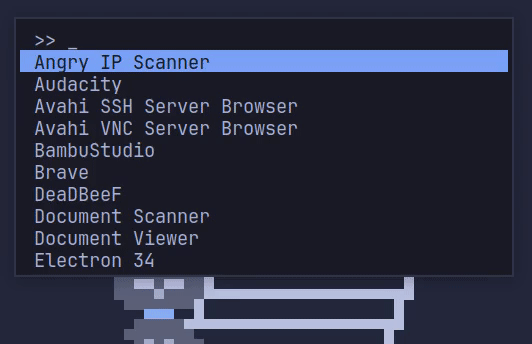

# nLauncher

> A lightning‑fast, X11‑native application and command launcher written in Nim.  
> Minimal dependencies, zero toolkit bloat, instant fuzzy search, and rich theming.



---

## Highlights

| Feature                            | Notes                                                                                          |
| ---------------------------------- | ---------------------------------------------------------------------------------------------- |
| **Typo‑tolerant fuzzy search**     | `firefx` → “Firefox”                                                                           |
| **Live clock**                     | Small HH:mm clock in the bottom‑right                                                         |
| **Sub‑1 ms startup (bench mode)**  | `--bench` flag for raw launch timing                                                          |
| **Recent‑apps history**            | Empty query shows your last launches first                                                    |
| **100 % keyboard‑driven**          | Arrow keys / Enter / Esc                                                                      |
| **Live theme cycling & persistence** | Press F5 to cycle themes; saves your last choice in the TOML config                           |
| **Fully themable via TOML**        | 25+ colour schemes built‑in; add your own under [[themes]] in `nlauncher.toml`                 |
| **Slash triggers**                 | `/ …` run shell command • `/c …` open dotfile • `/y …` YouTube • `/g …` Google • `/w …` Wiki     |
| **Zero toolkit**                   | Pure Xlib + Xft + [parsetoml](https://github.com/pragmagic/parsetoml)                          |

---

## Building & Running

> **Skip this if you use the pre‑built binary** from the latest release.

### Dependencies

- **Nim**: install via the recommended [choosenim](https://nim-lang.org/choosenim) script:  
  ```bash
  curl https://nim-lang.org/choosenim/init.sh -sSf | sh
  ```
- **X11 headers** & **Xft**:  
  - Arch/Manjaro: `sudo pacman -S libx11 libxft`  
  - Debian/Ubuntu: `sudo apt install libx11-dev libxft-dev`
- **Nimble packages**:  
  ```bash
  nimble install parsetoml x11
  ```

### Build

```bash
git clone https://github.com/DrunkenAlcoholic/nLauncher.git
cd nLauncher
nimble build -d:release   # produces ./nLauncher
```

### Command‑line flags

- `--bench` → prints millisecond‑precision startup timings and exits  

---

## Usage Cheat‑sheet

| Keys / Pattern      | Action                                                                   |
| ------------------- | ------------------------------------------------------------------------ |
| _Type letters_      | Instant fuzzy filter (typo‑tolerant)                                     |
| `/ …`               | Run shell command (everything after the slash is passed to your shell)  |
| `/c …`              | Search `~/.config` for dotfiles and open in your editor                  |
| `/y …`              | Search YouTube in browser                                                |
| `/g …`              | Google search in browser                                                 |
| `/w …`              | Wikipedia search in browser                                              |
| **Enter**           | Launch item / run command                                                |
| **Esc**             | Quit                                                                     |
| **↑ / ↓**           | Navigate list                                                            |
| **F5**              | Cycle built‑in themes                                                    |
| _(empty query)_     | Shows recent applications first                                          |

---

## Configuration

The first time you run `nLauncher`, it creates:

```
~/.config/nLauncher/nlauncher.toml
```

Copy & paste this skeleton or edit in place:

```toml
# nlauncher.toml

[window]
width               = 600  # Width in pixels
max_visible_items   = 12   # Max list rows (controls window height)
center              = true # If true, ignore position_x/y and use vertical_align
position_x          = 20   # X offset when center=false
position_y          = 50   # Y offset when center=false
vertical_align      = "one-third" # top | center | one-third

[font]
fontname = "JetBrainsMono:size=14" # Xft font string

[input]
prompt = "> "   # Prefix in the input box
cursor = "_"    # Character drawn under the typed text

[terminal]
program = "kitty" # Spawned for slash commands; falls back to $PATH search

[border]
width = 2       # Outer border thickness (0 disables)

# ── Available themes ───────────────────────────────────────────────────────
[[themes]]
name                   = "Nord"      # Theme identifier
bgColorHex             = "#2E3440"   # Background colour
fgColorHex             = "#D8DEE9"   # Foreground text colour
highlightBgColorHex    = "#88C0D0"   # Background of the selection row
highlightFgColorHex    = "#2E3440"   # Text colour when an item is selected
borderColorHex         = "#4C566A"   # Window border colour

[[themes]]
name                   = "Dracula"
bgColorHex             = "#282A36"
fgColorHex             = "#F8F8F2"
highlightBgColorHex    = "#BD93F9"
highlightFgColorHex    = "#282A36"
borderColorHex         = "#44475A"

# …add or remove more [[themes]] blocks as desired…

# ── Persist last theme ─────────────────────────────────────────────────────
[theme]
last_chosen = "Nord"  # Name of the theme restored on startup
```

---

## Built‑in Themes

A quick reference to the shipped themes (in the order they appear in TOML):

Nord • Dracula • Solarized Light • Solarized Dark • Gruvbox Light • Gruvbox Dark  
Catppuccin Frappe, Latte, Macchiato, Mocha • Ayu Light, Dark • Material Light, Dark  
One Light, Dark • Monokai • Monokai Pro • GitHub Light • GitHub Dark  
Cobalt • Palenight • Synthwave 84 • Tokyo Night Light • Tokyo Night • …and more

---

## Future

- **Icons & comments**: display app icons and `.comment` text alongside names.  
- **Wayland support**: investigate native layer‑shell integration (beyond X11).  
- **Plugin hooks**: let external scripts inject custom actions.  

---

## License

© 2025 DrunkenAlcoholic — MIT License  
Enjoy launching at ludicrous speed! 🚀
