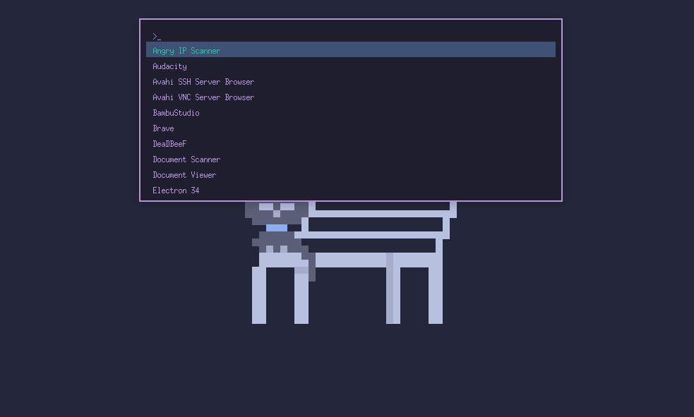

# Nim Launcher

> A simple, fast, and highly configurable application launcher for Linux (X11) written in pure Nim. Inspired by Rofi, designed for personal use and customization.



## Features

- **Fuzzy Search:** Instantly filters applications as you type.
- **Keyboard Navigation:** Fully controllable with the keyboard.
- **Borderless & Centered:** Clean and undecorated, appears centered on screen.
- **Fast Startup:** Caches results; only re-scans when `.desktop` files change.
- **Theme Support:** Choose from built-in themes or define your own.
- **Font Configuration:** Customize font family and size via config.
- **Lightweight:** No GUI toolkit overhead—pure X11 and Xft.

## Getting Started

### Requirements

- **Nim compiler**
- **X11 development libraries**
- **Optional:** [Fontconfig](https://www.freedesktop.org/wiki/Software/fontconfig/) if using custom fonts.

### Install Dependencies

#### Arch Linux / Manjaro:
```bash
sudo pacman -S nim libx11 libxft
```

#### Ubuntu / Debian:
```bash
sudo apt-get install nim libx11-dev libxft-dev
```

### Build & Run

```bash
git clone https://github.com/DrunkenAlcoholic/nim_launcher.git
cd nim_launcher
nimble install x11
nimble build -d:release
```

Move the resulting `nim_launcher` binary somewhere in your `$PATH`.

## Usage

### Launching

Bind the launcher to a key combo in your window manager or desktop environment.

For example, in i3:
```ini
bindsym $mod+d exec ~/path/to/nim_launcher
```

### Controls

| Key            | Action                          |
|----------------|----------------------------------|
| Type           | Filter applications via fuzzy search |
| ↑ / ↓          | Navigate list                   |
| Enter          | Launch selected application     |
| Escape / Focus Lost | Exit launcher             |

---

## Configuration

On first run, a default config file is created:

```
~/.config/nim_launcher/config.ini
```

### `[window]`

| Key                 | Description                                                              |
|---------------------|--------------------------------------------------------------------------|
| `width`             | Width of the window in pixels                                            |
| `max_visible_items` | Max number of entries shown at once                                      |
| `center`            | Center the window (`true`/`false`)                                       |
| `position_x`        | X position if `center = false`                                           |
| `position_y`        | Y position if `center = false`                                           |
| `vertical_align`    | `"top"`, `"center"`, or `"one-third"` when centered                      |

### `[font]`

| Key        | Description                                | Example                  |
|------------|--------------------------------------------|--------------------------|
| `fontname` | Font family and size (Xft-compatible name) | `Noto Sans:size=11`      |

### `[input]`

| Key      | Description                      |
|----------|----------------------------------|
| `prompt` | Text shown before user input     |
| `cursor` | Character shown at input cursor  |

### `[border]`

| Key     | Description                             |
|---------|-----------------------------------------|
| `width` | Width of the border in pixels           |

### `[colors]`

| Key                    | Description                           |
|------------------------|---------------------------------------|
| `background`           | Background color (e.g. `#2E3440`)     |
| `foreground`           | Font color                            |
| `highlight_background` | Selected item background              |
| `highlight_foreground` | Selected item text color              |
| `border_color`         | Window border color                   |

### `[theme]`

| Key    | Description                                                           |
|--------|-----------------------------------------------------------------------|
| `name` | Choose a built-in theme (case-insensitive), or leave blank for custom |

---

## Built-in Themes

You can set the theme using:

```ini
[theme]
name = Dracula
```

Available options:

- Nord
- Dracula
- Gruvbox Dark / Light
- Solarized Dark / Light
- Catppuccin (Mocha / Latte / Frappe)
- One Dark
- Monokai
- Material Dark / Light
- Ayu Dark / Light
- Cobalt

Leave `name` empty to use `[colors]`.

---

## Future Improvements (Ideas)

- Track & prioritize most used applications
- Optional application icon display (with toggle in config)
- Real-time highlight of matched letters during fuzzy search
- Optional mouse interaction or UI enhancements

---

## License

Licensed under GPL-3. See `LICENSE` for details.
